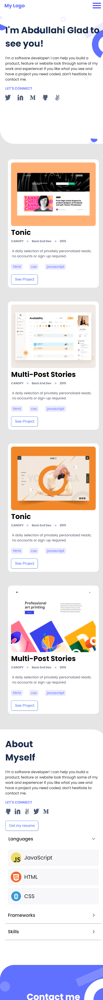

[](https://github.com/moshoodabdullahi/portfolio/actions/workflows/pages/pages-build-deployment)
[](https://github.com/moshoodabdullahi/portfolio/actions/workflows/linter.yml)

# PORTFOLIO

> A portfolio website is one of the most powerful tools in software developer toolbox, replicating one of the portfolio templates in Figma design.



## Built with

- HTML5 elements
  - Semantic elements such as `header`, `div`, `section` and so on.
- CSS properties
  - Typography such as `font-size`, `font-weight` and so on,
  - CSS flexbox such as `justify-content`, `align-items` and so on,
  - CSS Background for page aesthetic using `background-color`, `background-imge` and so on.
- Linters
  - [Prettier](https://prettier.io/),
  - [Stylelint](https://stylelint.io/).
- GitHub Action
- Acknowledgment
  - [Portfolio-project Figma Design](https://www.figma.com/file/LKueaSlr8Kc2yMKeZkKgtm/portfolio_project?node-id=0-1&t=832EHDclWuSK5XPh-0)

## Live Demo

[Netlify Demo Link](https://dema-portfolio.netlify.app/)

[GitHub Page Demo Link](https://moshoodabdullahi.github.io/portfolio/)

### Development (Running locally)

- Clone the project

```bash
git clone https://github.com/moshoodabdullahi/portfolio.git
```

- Install Dependencies

```bash
yarn install
```

To run StyleLint by itself, you may run the lint task:

```bash
yarn lint:check
```

Or to automatically fix issues found (where possible):

```bash
yarn lint
```

You can also check against Prettier:

```bash
yarn format:check
```

and to have it actually fix (to the best of its ability) any format issues, run:

```bash
yarn format
```

You can also check against webhint:

```bash
yarn hint
```

## Style Guides

- [CSS Style Guide](http://udacity.github.io/frontend-nanodegree-styleguide/css.html)
- [HTML Style Guide](http://udacity.github.io/frontend-nanodegree-styleguide/index.html)
- [Git Style Guide](https://udacity.github.io/git-styleguide/)

## 👤 Author

- Github: [@moshoodabdullahi](https://github.com/moshoodabdullahi)
- Linkedin: [@moshoodabdullahi](https://www.linkedin.com/in/moshoodabdullahi/)

## 🤝 Contributing

Contributions, issues and feature requests are welcome!

Feel free to check the [issues page](../../issues).

## Show your support

Give a ⭐️ if you like this project!

## Acknowledgments

- [Portfolio-project Figma Design](https://www.figma.com/file/LKueaSlr8Kc2yMKeZkKgtm/portfolio_project?node-id=0-1&t=832EHDclWuSK5XPh-0)

## 📝 License

[MIT licensed](./LICENSE).

## List of Points Checked

- Page titles (Issues Fixed) - This project title was changed to be able to distinguish between different website and to give additional explanation on your website. It is also shown in browsers' tabs when there are multiple web pages open. The page title was changed from "Portfolio" to "Abdullahi Porfolio", So as to identify it among multiple web pages.

- Image text alternatives() - (issues fixed) - The image text alternatives known as (img alt attribute) convey the purpose of an image, including pictures, illustrations, charts etc. It serves as an helping aid to people who are blind and use screen readers can hear the alt text read out. some changes were make to the img alt texts, But ther are different categories of alt attributes For example I change custom menu to menu because its a decorative, I change profile to screenshot of tonic by giving it a more meaningful explanation through alt attributes.

- Text headings (No Issues Found) - Web pages often have sections of information separated by visual headings, for example, heading text is bigger and bold (like "Headings" right above this sentence). To make these work for everyone, the headings need to be marked up. That way people can navigate to the headings — including people who cannot use a mouse and use only the keyboard, and people who use a screen reader. I found no issue in this aspect because firstly all text that looks like a heading is marked up as a heading, the heading hierarchy is also meaningful and didn't skip levels.

- Color contrast (Issues Fixed) - The color contrast aid visibility because some people cannot read text if there is not sufficient contrast between the text and background Some people cannot read text if there is not sufficient contrast between the text and background, High contrast is required by some people with visual impairments, including many older people who lose contrast sensitivity from ageing, But at the same time While some people need high contrast, for others — including some people with reading disabilities such as dyslexia — bright colors (high luminance) are not readable. They need low luminance. For example I increase the contrast of Let's Connect from 2.31 ratio to 4.50 ratio to increase it's visibility, I didn't fix the contrast of Canopy, Back End Dev and 2015 becaude of it's hover effect, And also i couldn't increase the contrast of contact article because increasing the contrast will change the website style completely, so no changes was make to the contact article.

- Resize
- Interaction (No issues found) 
- Moving content (No issues found)
- Multimedia (No issues found)
- The basic structure of the page
